# Argus

Your command center for Claude Code and GitHub Copilot CLI sessions. Watch every session live, send commands, and stop runaway agents, all from a single browser tab. Control your sessions remotely via Microsoft Teams or Slack.

## Supported

- **Works with:** Claude Code · GitHub Copilot CLI 
- **Integrates with:** Microsoft Teams · Slack 
- **Runs on:** Windows · macOS · Ubuntu 

## Links

- **Landing Page**: [aarthi-ntrjn.github.io/argus](https://aarthi-ntrjn.github.io/argus)
- **npm**: [npmjs.com/package/argus-ai-hub](https://www.npmjs.com/package/argus-ai-hub)
- **GitHub**: [aarthi-ntrjn/argus](https://github.com/aarthi-ntrjn/argus)
- **Contributor docs**: [docs/README-CONTRIBUTORS.md](docs/README-CONTRIBUTORS.md)

## Requirements

- Node.js 22 LTS
- [GitHub Copilot CLI](https://github.com/features/copilot/cli/) and/or [Claude Code](https://docs.anthropic.com/en/docs/claude-code/getting-started) installed

**Optional:**
- [Slack app](#slack) for Slack integration
- [Azure Bot](#microsoft-teams) for Microsoft Teams integration

## Getting Started

Run with npx (no install required):

```sh
npx argus-ai-hub
```

Or install globally so `argus-ai-hub` is always on your path:

```sh
npm install -g argus-ai-hub
argus-ai-hub
```

Open **http://localhost:7411** and you're in. The port is configurable in [`~/.argus/config.json`](#storage).

## Monitor & Control

See everything happening across your AI sessions without switching terminals. 
Launch sessions directly from Argus and send prompts to these sessions from the Argus dashboard.

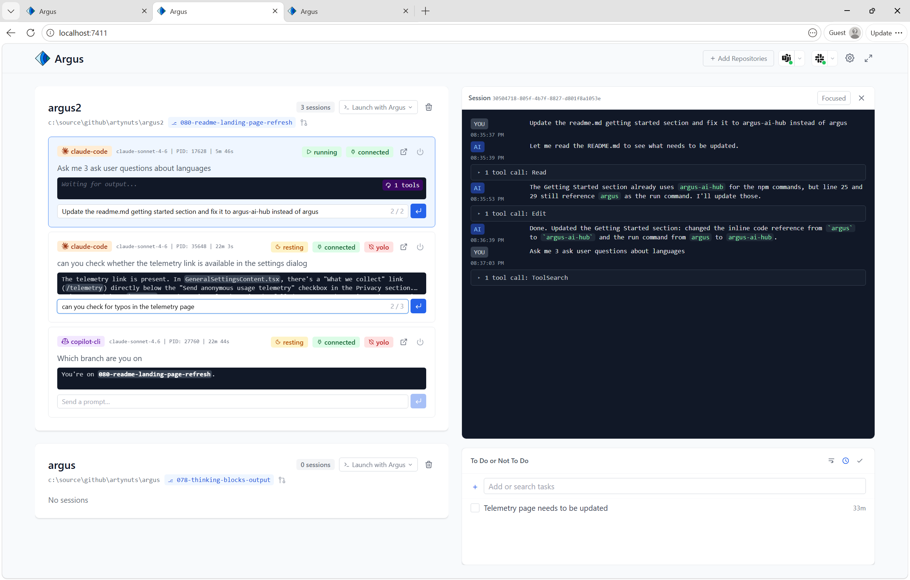

### Session Cards

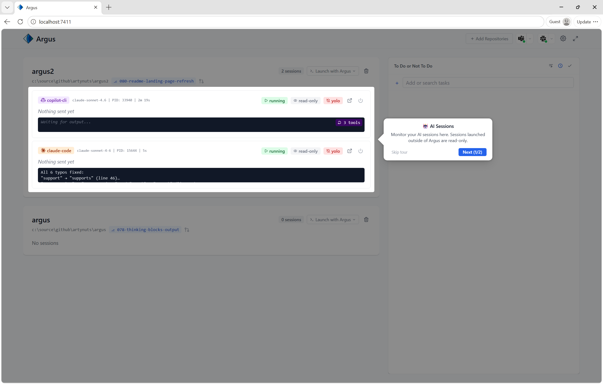

Each card is a live snapshot of a session:

- **CLI badge** (copilot-cli / claude-code) Argus currently supports GitHub Copilot CLI and Claude Code CLI
- **Status badge** (running / resting / ended) Running - for conversations that have had activity within the configured resting threshold (default: 20 minutes), resting for conversations that have had no activity beyond the threshold, Ended for conversations that have exited.
- **Session type** (readonly / connected) readonly - for conversations that were started outside of Argus, these sessions can be monitored only, they cannot be controlled from Argus. connected - for conversations that were started from Argus using _Launch with Argus_, these sessions can be monitored and controlled from Argus using the send prompt input
- **Model** in small monospace text when known (e.g. `claude-opus-4-5`)
- **PID** when known. For Claude Code sessions without a detected PID, a **session ID prefix** is shown instead (e.g. `ID: abc12345`)
- **Elapsed time** representing how long since the session start
- **Drill in link**: displays a larger view of the session.
- **Current prompt**: the most recent question you asked, shown below the badges and updated live as the conversation progresses
- **Last output preview**: up to 2 lines of the session's current output state, rendered in a dark monospace box. Four display states:
  - *Waiting for output...* (italic, gray): no output received yet
  - Assistant reply text (markdown-rendered): AI replied, no active tool calls
  - `Running... N tool call(s)`: AI is executing tools with no prior reply visible
  - Assistant reply text + `+N tool call(s)` suffix: AI replied and is now making further tool calls
- **Send prompt input and button**: (only in live sessions) Type a prompt and send to the CLI session from Argus. This also supports prompt history navigation using Up and Down Arrow keys

### Session Output

Click any card to open a **live output pane** on the right inline. The card list stays visible on the left.

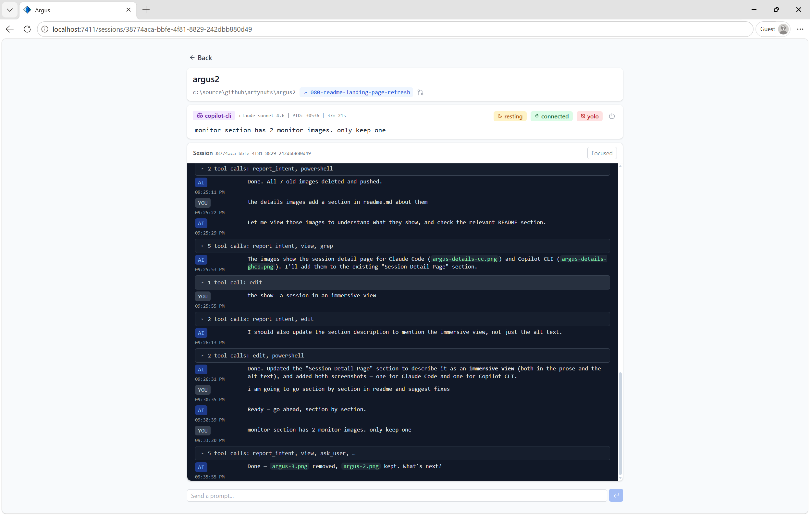

Output lines carry type badges so you always know what's what: **YOU** (your input), **AI** (assistant reply), **TOOL** (tool call), **RESULT** (tool result), **STATUS** (status change), **ERR** (error). These are streamed in real time, including tool calls.

#### Focused and Verbose Mode

Toggle between **Focused** (default, noisy tool results collapsed) and **Verbose** (everything expanded) using the button in the pane header. The selected mode persists across sessions.

### Starting a Session with Prompt Control

To send prompts to a session, start it through Argus.This gives Argus a direct PTY write channel to the process.

Click the **Launch with Argus** dropdown in any repo card header and select **Launch Claude** or **Launch Copilot**. If neither tool is detected on your PATH, the dropdown shows install links for [Claude Code](https://docs.anthropic.com/en/docs/claude-code/getting-started) and [GitHub Copilot CLI](https://github.com/features/copilot/cli/).

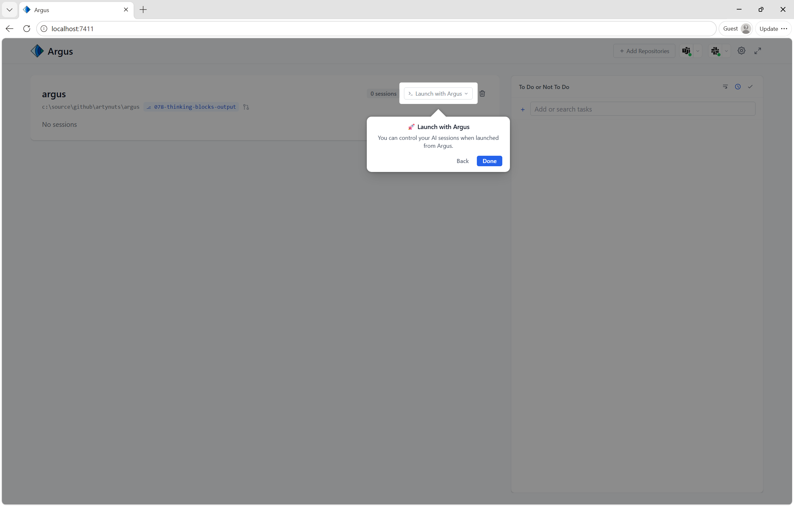

Sessions launched from Argus appear as **connected** and show the prompt input bar.

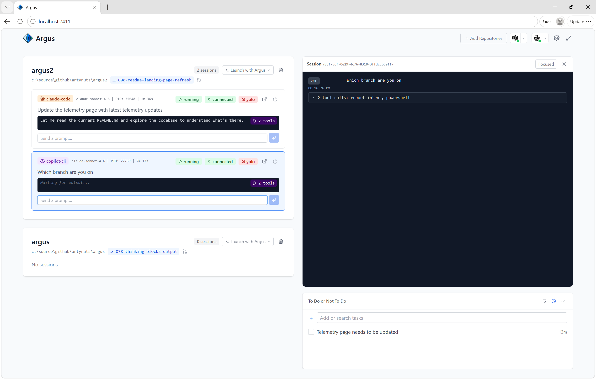

#### Headless Environments (Codespaces, SSH, no TTY)

When Argus detects it is running in a headless environment (no interactive terminal available, such as GitHub Codespaces or a remote SSH session), the launch dropdown switches to copy mode. 

### Readonly Sessions

Sessions detected automatically (not started via `argus launch`) show a **read-only** badge. Their prompt bars are not visible. Use the **Kill Session** button to terminate any session with a known PID.

### ATTENTION NEEDED Alerts

#### Ask User Question Alerts

When an AI session is waiting for user input, the session card shows a bold red **ATTENTION NEEDED** indicator with the question and any numbered choices. Appears on both read-only and connected sessions.

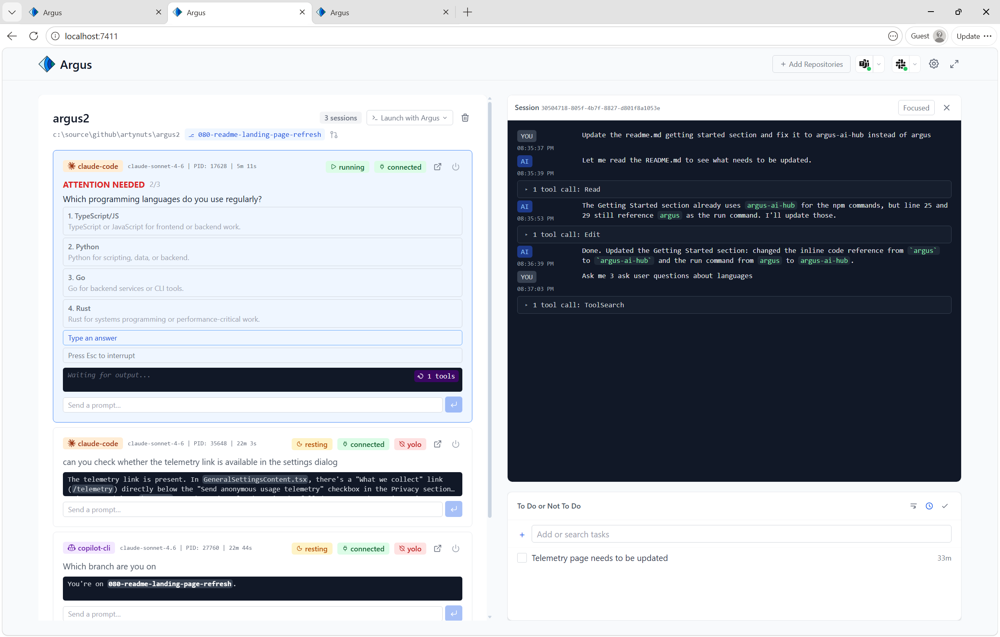

#### Tool approval in non-YOLO mode Alerts

When a session is running without auto-approval, any tool use that requires confirmation (bash commands, file writes, etc.) is also surfaced on the session card. 

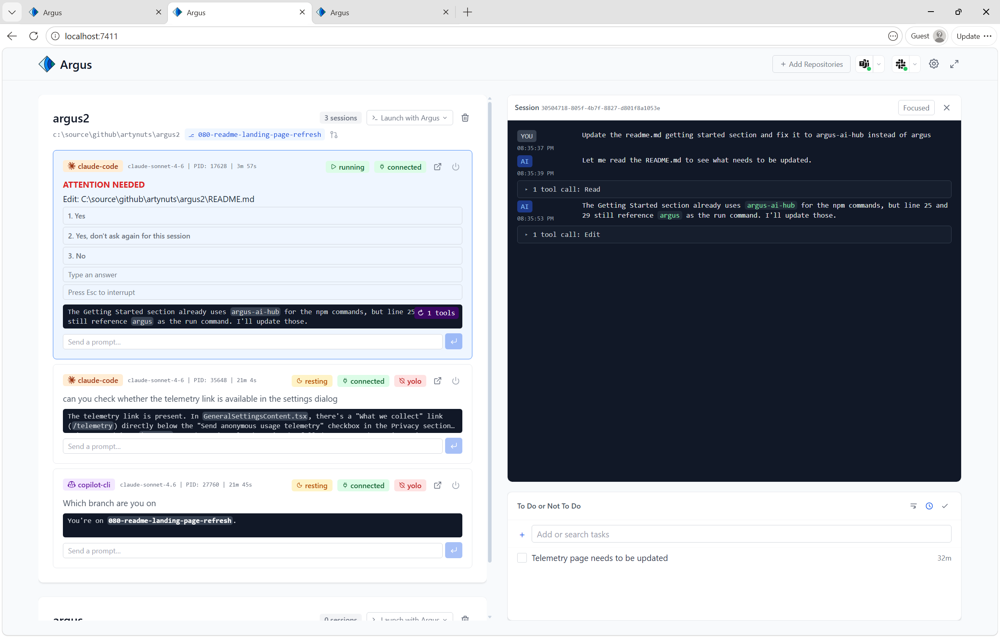

### Session Detail Page

The drill-in link on any session card opens a full-page immersive view of that session. 

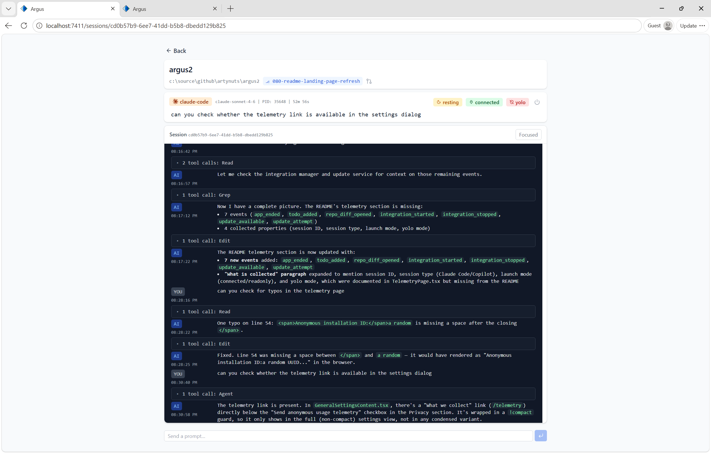

### Killing a Session

Every session card and the session detail page have a **kill button** (⏻ icon) next to the session badges. 
You can also type **/exit** in the input prompt to kill a session.

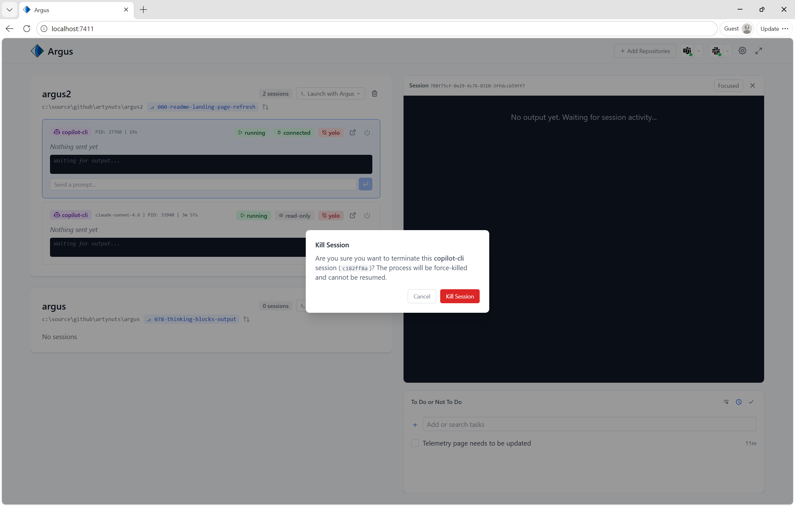

### Repository Management

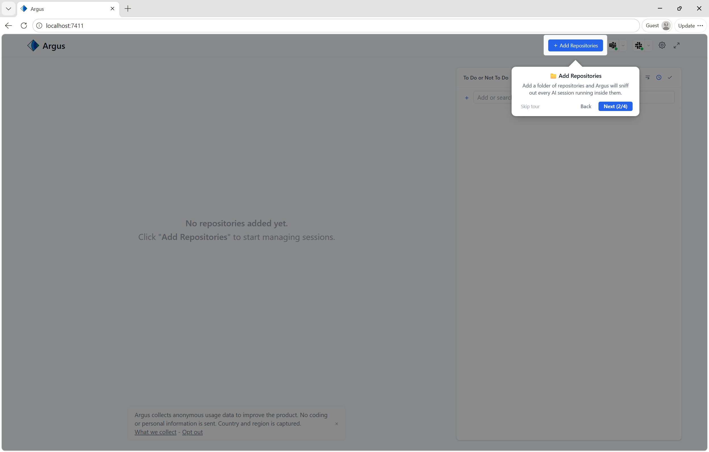

Click **Add Repository**, type or paste a root folder path (e.g. `C:\source` or `/home/user/projects`), then click **Scan &amp; Add**.

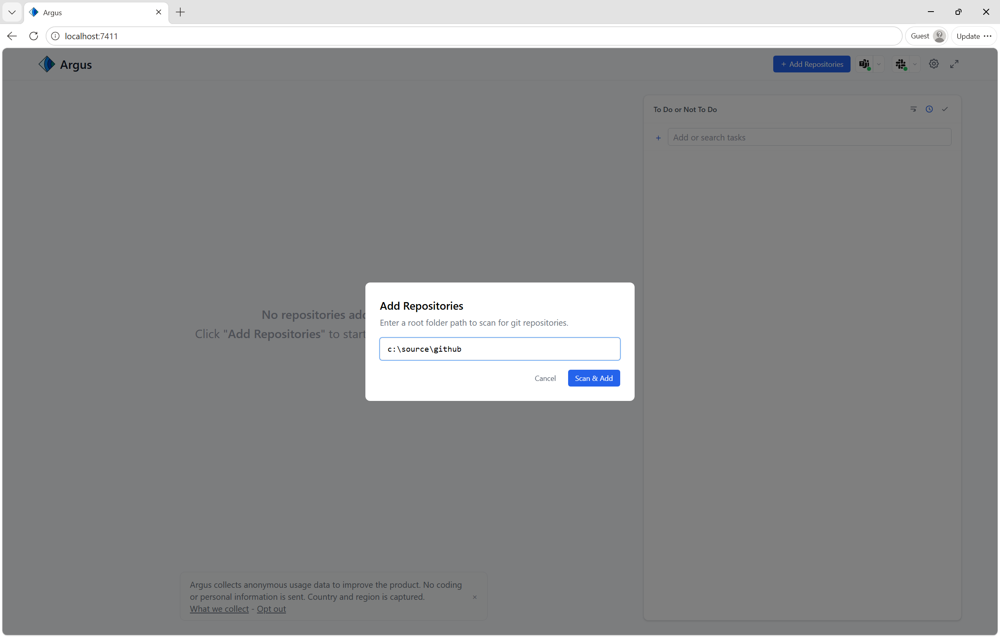

Argus scans that folder recursively for git repos and registers all new ones in one go. Already-registered repos are skipped automatically.

Each repo card shows the current branch name and, when the remote is a GitHub repository, three clickable surfaces: the **repository name** links to the repo's GitHub home page, the **branch chip** links to the branch's tree view on GitHub, and the **pull-request icon** links to GitHub's `/pull/new/<branch>` page 

#### Reponsive UX

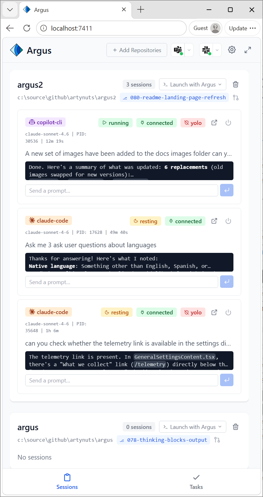

Argus is designed to sit side-by-side with your editor. On narrow viewports it reflows so you can snap it next to VS Code or any other tool without losing functionality.

## To Do or Not To Do

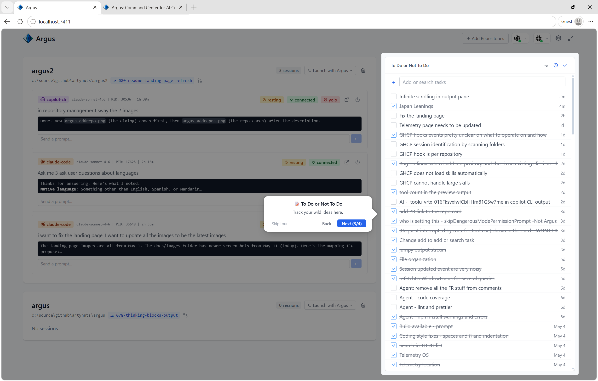

The **To Do or Not To Do** panel lives on the right side of the dashboard. Use it to jot down tasks, reminders, or notes. Type to filter the list in real time; press **Enter** to save as a new item.


## Roaming Integrations

Monitor and control your AI sessions from anywhere. Argus integrates with Microsoft Teams and Slack so you can receive live session updates and send prompts directly from your chat tool, without opening the dashboard.

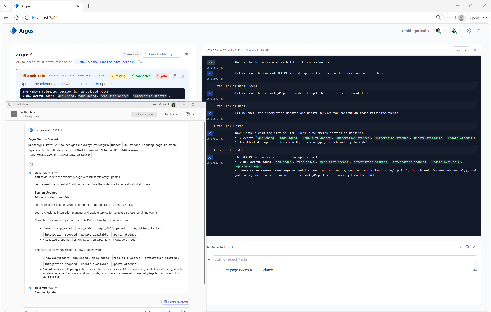
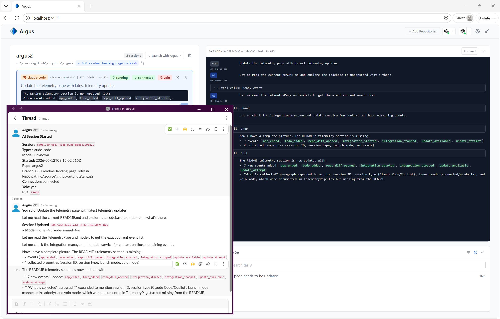

### Commands

| Command | Response |
| ------- | -------- |
| `@YourBot <prompt text>` | Sends a prompt to the active session |
| `@YourBot sessions` | Lists all active AI sessions |
| `@YourBot status <sessionId>` | Shows details for a specific session |
| `@YourBot help` | Lists available commands |

In Teams, reply to any session thread to send a prompt directly to that session.

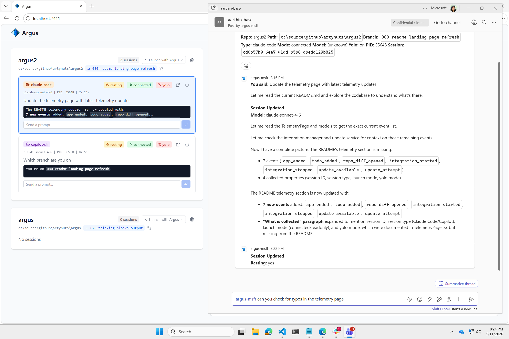

In Slack, you can also send commands as direct messages to the bot.

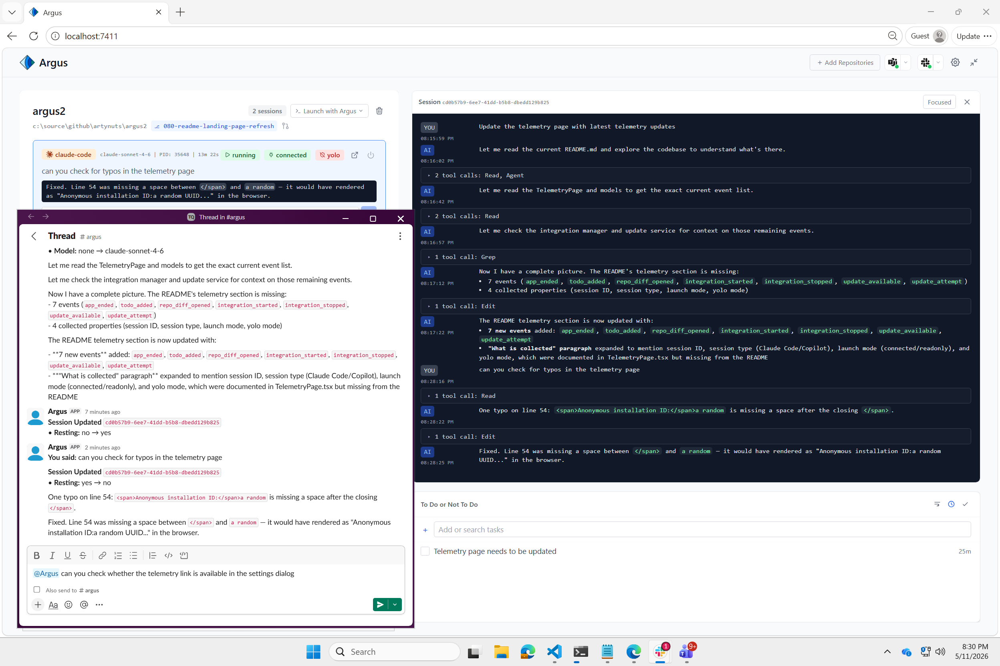

### Setup

Configure via the **Teams** and **Slack** tabs in the Argus Settings dialog. For full setup instructions, see [docs/README-TEAMS-APP.md](docs/README-TEAMS-APP.md) and [docs/README-SLACK-APP.md](docs/README-SLACK-APP.md).

## Dashboard Settings

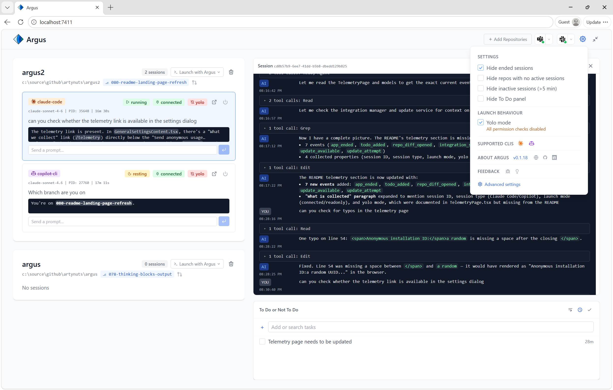

### Launch Behaviour: Yolo Mode

| Setting    | Default | Description                                                                             |
| ---------- | ------- | --------------------------------------------------------------------------------------- |
| Yolo mode  | Off     | Launches all sessions with all permission checks and safety prompts disabled            |

When **Yolo mode** is enabled, a warning dialog is shown. After confirmation:

- **Claude Code** sessions are launched with `--dangerously-skip-permissions`
- **Copilot CLI** sessions are launched with `--allow-all`

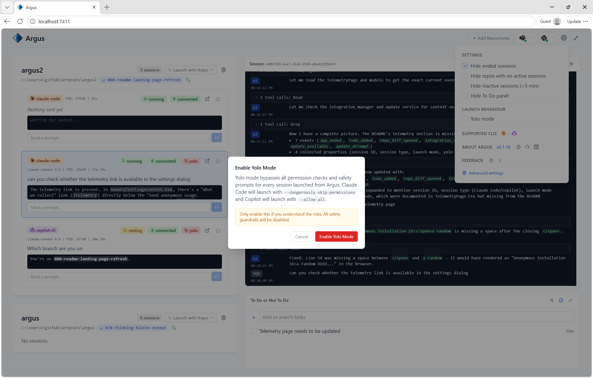

This applies to sessions launched directly from the Argus UI. 
To disable, toggle Yolo mode off in Settings. No confirmation is required to disable.

## Auto Update

Argus checks npm for a newer version at startup and every 4 hours. When a newer version is available:

- An **Update to vX.Y.Z** button appears in the header, visible from any page. Click it to apply the update immediately.
- When you stop Argus (Ctrl+C), it applies the update automatically before exiting.

To turn off the on-exit update, uncheck **Auto-update on exit** in the Settings **About** tab.

## Telemetry

Argus collects anonymous usage data (session counts, feature usage, errors). No prompts, file paths, or personal information are ever sent. Disable it at any time in Settings under Privacy.

## Feedback

Found a bug or have a feature idea? Use the **Feedback** dropdown in the top-right corner of the dashboard, or go directly to the [GitHub Issues page](https://github.com/aarthi-ntrjn/argus/issues).

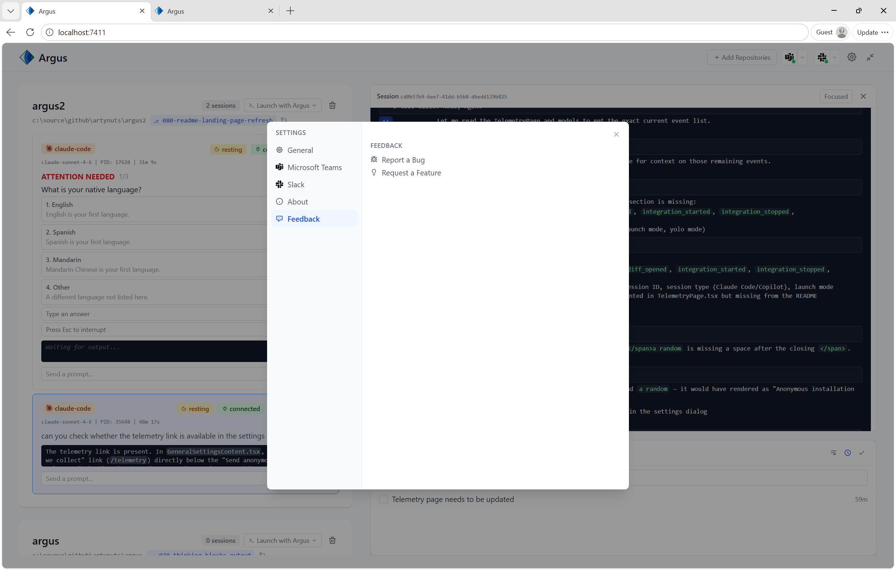

## Uninstall and Cleanup

If you installed Argus globally via npm:

```bash
npm uninstall -g argus-ai-hub
```

To remove all Argus data:

```bash
rm -rf ~/.argus
```

## Configuration

Argus stores all data and config in `~/.argus/`:

| File | Purpose |
| ---- | ------- |
| `~/.argus/config.json` | Port, retention settings, auto-update |
| `~/.argus/argus.db` | SQLite: repos, sessions, output |
| `~/.argus/slack.config` | Slack integration credentials |
| `~/.argus/teams-config.json` | Teams integration credentials |

Default port: **7411**. Override with `{ "port": 7411 }` in `~/.argus/config.json`.

## For Contributors

See [docs/README-CONTRIBUTORS.md](docs/README-CONTRIBUTORS.md) for architecture, dev setup, API reference, security model, CI pipeline, and development guides.
