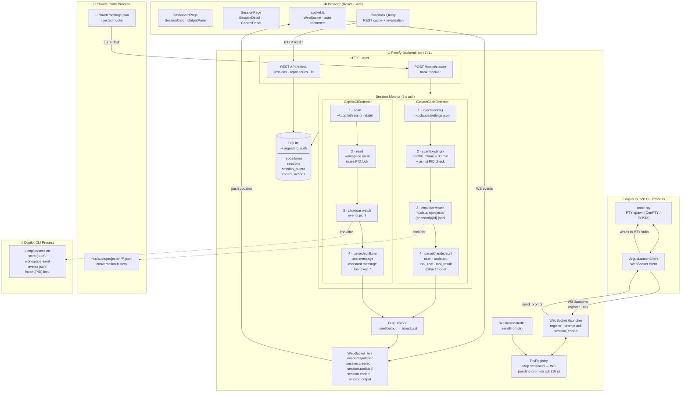

# Argus: Architecture

Argus is a local dashboard that gives you centralized visibility and remote control over Claude Code and GitHub Copilot CLI sessions running on your machine. It runs a Fastify backend (Node/TypeScript) that watches AI tool files on disk and injects hooks, stores everything in SQLite, and streams updates to a React frontend over WebSockets.

## Key Design Decisions

- **No agents/APIs**: detection is purely file-system based (no Copilot API calls, no Claude API calls)
- **Claude Code hooks** are injected into `~/.claude/settings.json` to receive push events; Copilot is detected passively via file watching
- **WebSocket push** keeps the UI live; TanStack Query handles caching and cache invalidation on WS events
- **SQLite** stores full session history with configurable retention via `pruning-job.ts`

### PTY Prompt Delivery

When a user runs `argus launch <tool>` instead of invoking the tool directly, Argus gains reliable bidirectional control over the session.

**Why PTY?** Injecting text into a running process via stdin (`TIOCSTI`) was removed from macOS after Ventura and is unavailable on Windows. PTY allocation (via `node-pty`, which uses Windows ConPTY and POSIX PTY, the same infrastructure VS Code uses for its integrated terminal) is the only cross-platform mechanism for writing to a terminal-attached process stdin without kernel privilege.

**Send-prompt flow:**

1. The browser submits a prompt via `POST /api/v1/sessions/:id/send`.
2. `SessionController.sendPrompt()` checks `launchMode`. If the session is `'pty'` but no launcher WebSocket is registered, it returns a `failed` control action immediately.
3. `PtyRegistry.sendPrompt(sessionId, actionId, prompt)` sends a `send_prompt` message over the `/launcher` WebSocket connection held by that session's `argus launch` process.
4. The `ArgusLaunchClient` inside the `argus launch` process receives the message and writes the prompt text to the PTY stdin, so the spawned tool receives it as if the user typed it.
5. The CLI acknowledges with `prompt_delivered` (or `prompt_failed`), which resolves the pending promise in `PtyRegistry` within a 10-second timeout.
6. `SessionController` updates the control action to `completed` (or `failed`) and broadcasts a WebSocket event to the browser.

**Session lifecycle**: On disconnect of the `/launcher` WebSocket, the route handler marks the session as ended and unregisters the entry from `PtyRegistry`. The frontend `SessionPromptBar` shows a "live" badge for PTY sessions and disables prompt input entirely for passively detected sessions (no launcher connected).

## Development Tooling

All feature work follows a Speckit specification-driven pipeline (`specify → clarify → plan → tasks → analyze → implement`). See `CLAUDE.md` for the full workflow: it is the single source of truth for both Claude Code and the GitHub Copilot CLI.

Speckit skill definitions live in `.claude/commands/`. The CI pipeline (`.github/workflows/ci.yml`) enforces lockfile integrity, action SHA pinning, and critical CVE auditing on every push.
